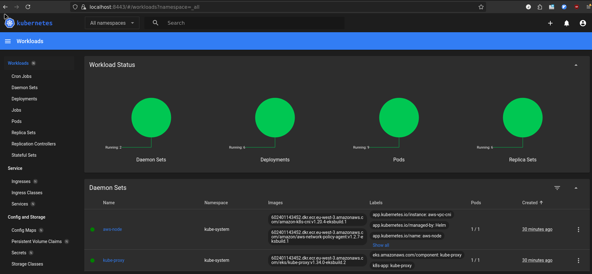

# My AWS infra

## Features / TODO

### iac setup
- [x] Setup a global budget limit of $20
- [x] Store tfstate in S3 bucket
- [x] EKS (AWS managed K8S) + CloudWatch for it
- [x] Managed Node Group multi AZ (only using tg4.small and 2 AZ configured) (arm64, Amazon linux AMI)
- [x] Simple VPC and Security Group for EKS and the Node Group
- [x] OIDC + IRSA everywhere

### Release engineering
- [x] ECR (Managed Registry)
- [x] CI for OpenTofu (lint, format iac code and tf plan and tf apply + comment in the PR)
- [x] CI for our Golang micro-services (lint, format, release, build on arm64 runners and push images on ECR)
- [x] Proper release when rebasing on master & push the release tag on ECR for each services 

### Micro-services and infra setup
- [x] RDS (Simple single RDS that will store a counter and accessible from our micro-services running in EKS) (inside a private subnet with a private Route53 DNS)
- [x] 2 micro-services deployable (one that expose a public web server and send a request to the second one that update the counter in a RDS)
- [x] Deploy manually to EKS (Deployments + Service in simple yaml)
- [x] Healthchecks in the micro-services (liveness, readiness & startup probes)

### Observability
- [X] Access the Kubernetes Dashboard (deployed using helm)
- [X] Prometheus, Loki & Grafana (in a separate namespace and on another node group, deployed with terraform and the helm provider)
- [X] Add Metrics in each micro-services
- [ ] Grafana dashboard for our EKS (CloudWatch)
- [ ] Grafana dashboards for our micro-services
- [ ] Grafana dashboard for our RDS (CloudWatch)
- [ ] Node Exporter for our instances

### Scaling and K8S config
- [ ] Learn, setup and configure HPA (HorizontalPodAutoscaler)
- [ ] Learn and configure PDB (PodDistruptionBudget)
- [ ] Script to simulate scaling by sending a ton of requests (grafana/k6)

### Chaos Engineering
- [ ] Script to simulate traffic and trigger scaling (grafana/k6 ?)
- [ ] Script to make a sanity check of both micro-services (endpoints are 200, kubectl get pods shows RESTARTS=0 and Ready status true)
- [ ] Script to simulate a DB/readiness failure (kubectl set env DB_URL=invalid -> rollout -> observe /readiness -> 503 -> pod state is not altered (no restart), and kubectl get endpoints is empty)
- [ ] Script to simulate a liveness failure (kill the pod -> pod will be restarted, crashloopbackoff if failures are repeating)
- [ ] Look for chaos monkey framework

### Automatic deployment
- [ ] CD (Argo CD for deploying)
- [ ] CD (Automatic rollback with Argo Rollout)

### SRE stuff
- [ ] Monitor golden signals in Grafana 
- [ ] Define clear SLA / SLI / SLO for our Application feature
- [ ] Monitor our SLI / SLO in Grafana


### Docs
- [ ] Architecture Diagram
- [ ] Create some small ADR for the choices made along the way
- [ ] Finalize README + demo screenshots + demo gif

## Bonus

- [ ] Use spot in our Managed Node Group (using a custom launch template)
- [ ] Replace default ELB when creating a service type load balancer to a ALB
- [ ] RDS Backup & Restore (Velero ?)
- [ ] Devenv shell to setup dev environment
- [ ] Helm support for apps deployment
- [ ] Karpenter for automatic spot provisionning (replace Node group)
- [ ] Chaos engineering to simulate failing code deployment, kill eks node, slow RDS ? ...
- [ ] Post Mortem
- [ ] Create a Runbook based on the possible failures
- [ ] Simple golang e-BPF tracing
- [ ] Cilium (Circuit breaking ?) 
- [ ] Tempo ? (OpenTelemetry)
- [ ] LinkedIn post lmao

## Init

### OpenTofu

```
cp env.dist .env
```

```
tofu -chdir=iac init

tofu -chdir=iac plan 

tofu -chdir=iac apply
```

Get access to the cluster through kubectl on remote machine
```
aws eks update-kubeconfig --region $AWS_DEFAULT_REGION --name justalternate-eks-cluster 
```

### Install and Access the kubernetes dashboard 



Install the dashboard using Helm

```
./services/kube-dashboard/deploy-dashboard.sh
```

Create a connection to the dashboard using port-forward and generate a token

```
./services/kube-dashboard/open-dashboard-and-get-token.sh
```

Naviguate to the dashboard

```
firefox https://localhost:8443
```

### Access Grafana

```
kubectl port-forward -n monitoring svc/kube-prometheus-stack-grafana 3000:80
```

```
firefox http://localhost:3000
```

Connect to grafana using the password specified in `./iac/observability-stack-config/prometheus-stack-values.yaml` which is : `admin`

### ECR

Login to the ECR in case you want to manually push image to it
```
AWS_FULL_ECR_URL="https://$(aws sts get-caller-identity --query 'Account' --output text).dkr.ecr.$AWS_DEFAULT_REGION.amazonaws.com"
aws ecr get-login-password --region $AWS_DEFAULT_REGION | docker login -u AWS --password-stdin $AWS_FULL_ECR_URL
```

## Deploy some apps

### Deploy public containers

Deploy with kubectl directly
```
kubectl run test-pod --image=nginx --restart=Never
```

Or 

Using yaml definition :

```
kubectl apply -f services/nginx-test-hello-world
```
This will create a Deployment of nginx with 2 replicas as well as a Load Balancer to access it

### Deploy our own apps

#### Create ECR repository if not exist

Add your repository for each app you want to build and store
```
nvim iac/storage/ecr.tf
```

#### Build and push to ecr locally

```
AWS_ACCOUNT=$(aws sts get-caller-identity --query 'Account' --output text)
AWS_ECR_URL=$AWS_ACCOUNT.dkr.ecr.$AWS_DEFAULT_REGION.amazonaws.com
```

```
# Build them for arm64
docker build --platform linux/arm64 ./apps/api/ -t api -f apps/api/Containerfile
docker build --platform linux/arm64 ./apps/web-server/ -t web-server -f apps/web-server/Containerfile
```

```
# Tag them
docker tag api:latest $AWS_ECR_URL/api:latest
docker tag web-server:latest $AWS_ECR_URL/web-server:latest
```

```
# Push them
docker push $AWS_ECR_URL/api:latest
docker push $AWS_ECR_URL/web-server:latest
```

Or 

add you service in the `.github/workflows/build-push-dev.yml` and the `.github/workflows/release-build-push-prod`

#### Deploy our micro-services to EKS using our stored images in ECR

```
kubectl apply -f ./services/api
kubectl apply -f ./services/web-server
```
